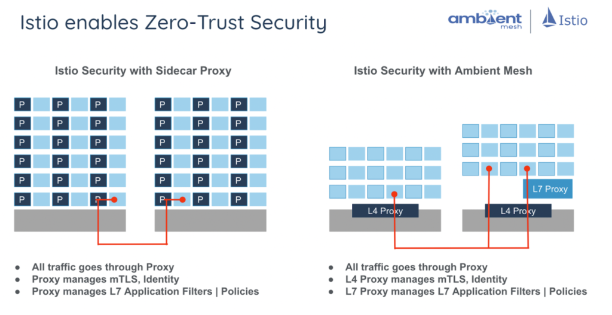
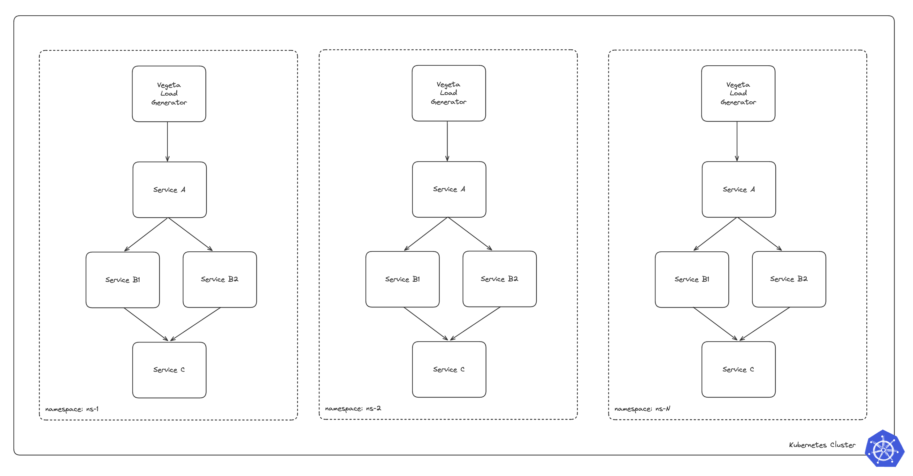
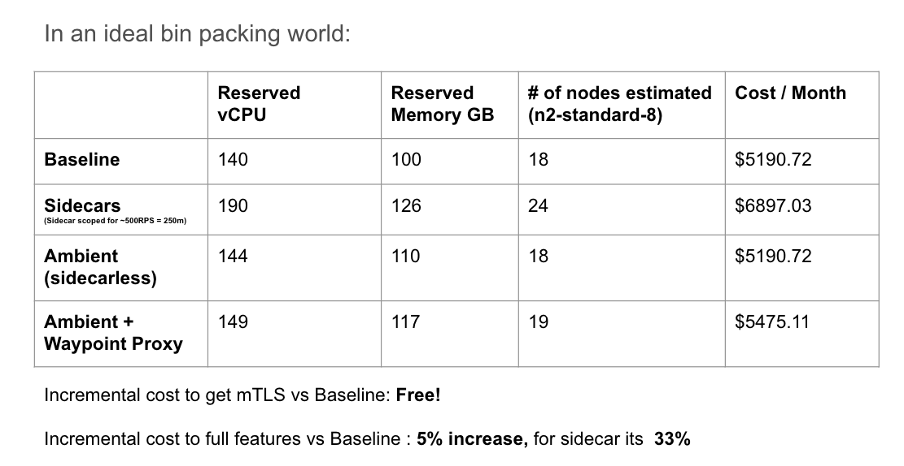
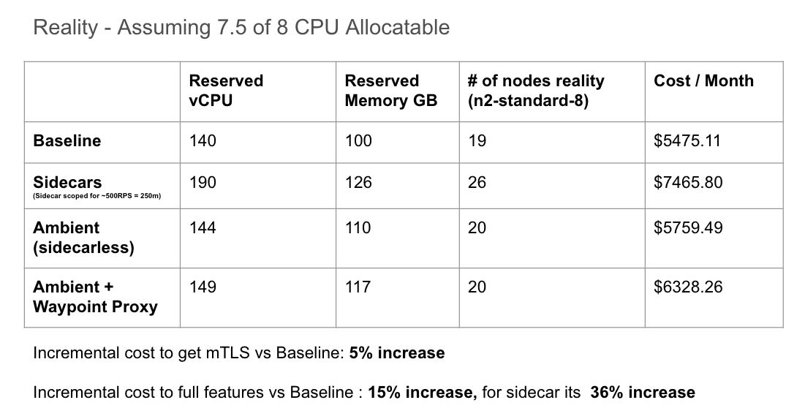
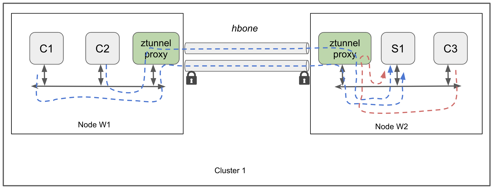

# Istio in Ambient Mode - Doing More for Less!

With the introduction of Istio's ambient data plane mode, platform teams can more efficiently adopt service mesh features without introducing a significant resource overhead to their end consumers.

Here at Solo.io a common story that we hear among our customer-base and prospects that goes like this:
"The Security team has mandated a zero-trust posture across the entire organization, and as a result of this requirement I am looking to adopt a service mesh. However, in doing some research we have discovered that leveraging a sidecar based approach will incur some additional cost in resource reservations per app (by default in Istio 100m CPU and 128Mi MEM per sidecar or 0.5 CPU per 1000 RPS), and operational overhead in managing the lifecycle of a sidecar deployment"

For teams with tight budgets, complying with this mandate presents significant opportunity costs. Trade-offs such as deciding between hiring additional staff or investing in other areas of the business versus bearing the increased cost of resources for the application becomes a critical consideration.

In conversations with those further along in their service mesh journey, it's often highlighted that the sidecar pattern offers an array of L7 capabilities, including:
- Advanced traffic management and routing control
- Native support for mutual Transport Layer Security (mTLS) in the ingress solution
- Fine-grained security policies at the application layer
- Efficient handling of circuit breaking and fault tolerance mechanisms
- Facilitated implementation of service discovery and dynamic service routing
- Simplified deployment of A/B testing and canary release strategies

But what if the user doesn't need these capabilities in the near-term? Despite their potential benefits to the organization, implementing and maintaining these additional value-add features also comes at a cost and requires a level of organizational maturity. Moreover, the costs are incurred regardless of their utilization, potentially pressuring the team to prioritize these features even if they're merely nice-to-haves.

# Ambient Mode
[Ambient mode](https://www.solo.io/blog/istio-ambient-mesh-evolution-service-mesh/) was launched on September 7th, 2022, introducing a new Istio data plane mode without sidecars that’s designed for simplified operations, broader application compatibility, and reduced infrastructure cost. Ambient splits Istio’s functionality into two distinct layers: the zero trust secure overlay layer, and optional Layer 7 processing layer. Compared with sidecars, the layered approach allows users to adopt Istio incrementally from no mesh, to mTLS based zero-trust overlay, to full L7 processing as needed. This gives service mesh users two outstanding options from the same dedicated community: Istio with a sidecar model approach, or sidecarless Ambient mode.




Now, returning to our original problem statement, in order to comply with the zero-trust mandate from Security, we no longer need to adopt a sidecar per application. Instead, we can leverage ambient mode's `ztunnel` per-node architecture, which separates the responsibilities of zero-trust networking and Layer 7 policy handling. The resource costs associated with these components are as follows:

Istio Component Resource Requirements (all configurable for smaller deployments):
- ztunnel - `200m` CPU and `512Mi` memory per node
- istio-cni - `100m` and `100Mi` memory per node
- istiod - `500m` and `2Gi` memory per replica
- waypoint proxy - `100m` CPU and `128Mi` per replica

Ambient mode enables us to meet the mTLS requirement with a model that is less coupled to the resource costs of individual applications and instead scales with the cost of the platform itself (more nodes, more `ztunnels`). With this approach, Application Owners no longer need to concern themselves with the presence of a sidecar in their workload, the lifecycle of that sidecar, and even the cost of the sidecar resource. Users of the sidecarless service mesh can assume that if the application is deployed on the cluster, it is inherently secure by default. Developers can then focus on developing and deploying their applications, increasing operational efficiency and providing a more seamless and frictionless developer productivity experience.

# Let's look at some numbers

Lets take the following workload for our large scale application experiment:

Application Details:
- 50 namespace isolated applications
- 3-tier application structure
    - 4 deployments per namespace, 1 replicas per deployment 
    - A > B1,B2 > C
    - CPU requests: 700m // CPU limits: 700m (guaranteed QoS)
    - MEM requests: 500Mi // MEM limits: 500Mi (guaranteed QoS)

Baseline Resource Requirements:
When calculating the baseline resource requirements without service mesh enabled:
- Total application baseline requirements are 140 CPU cores and 100 GB memory

Total expected baseline requirements: 140 CPU Cores and 100 GB memory. Note that this excludes the load generator clients in this calculation as we are focusing on just the baseline application footprint for this exercise

A high level architecture looks like this:



## In an ideal bin packing scenario


In an ideal world, where everything is perfectly scheduled like an expert tetris player, our capacity planning exercise would be a rather simple calculation



Source: using the [Google Cloud Pricing Calculator](https://cloud.google.com/products/calculator?hl=en)

## Reality is not an ideal bin packing scenario


In reality, Kubernetes scheduling is not perfect, and inefficiencies in bin packing workloads will result in additional resources consumed (nodes created) so that all workloads can be scheduled. The following table shows the actual results of deploying the example application described in our test environment:



The results mirror the goals of the Ambient project in both simplifying operations of the service mesh (no sidecars!) as well as reducing infrastructure costs (no additional cost to fulfill mTLS requirement). We also see an added benefit where if we decide to incrementally adopt the full L7 feature set by adopting waypoint proxies, the cost would be **+15%** from baseline using `ztunnel` + waypoint proxies vs. the traditional sidecar approach at **+36%** of your baseline cost

# Simplifying Operations


One of the most common challenges that we see with service mesh adoption is the increase in operational overhead to manage the lifecycle of the sidecar for the Platform or Application owners. An example is depicted above - when transitioning from 1.19 to 1.20 every proxy sidecar in the cluster must be restarted to apply the new proxy version. Without a proper strategy in place, this operation can lead to significant downtime and disruption.

With a sidecar approach, users need to ensure that Kubernetes + proxy is configured to do the following:
- Initiate the draining process and stop accepting new connections
- Ensure that all connections are drained before termination
- Configure the Kubernetes scheduler to avoid premature pod termination
- Terminate early if all active connections close

All of these considerations go away when adopting a sidecarless service mesh architecture! This new approach significantly reduces this operational burden, providing more time for developers to focus on developing application features rather than infrastructure related concerns of managing proxies at scale.

# What about Performance?

With the premise of this blog post focused on doing more for less, we have already covered two initial goals of ambient mode in reducing infrastructure cost as well as simplifying operations. But what about performance?

Taking the example app above, we ran the following experiment to validate that ambient mode can perform at-par or better than the traditional sidecar data plane mode. For this test, we evaluated the same application deployed on a cluster with Linkerd against a cluster with Istio in ambient mode.

First we set some baseline performance requirements for our 3-tier application workload that is deployed across 50 namespaces. 

Our application latency expectations:
- Max P50 latency < 5ms
- Max P99 latency < 15ms

We configured a Vegeta loadgenerator client per-namespace with a guaranteed QoS by setting resource requests/limits to `500m` CPU and `300Mi` MEM for this experiment:

Our Loadgenerator Client Configuration:
- Load generator per namespace targeting tier 1 application level
  - deployed to separate loadgen node pool to ensure unbiased performance measurements by preventing resource contention and interference
  - using n2-standard-8 spot instances in autoscaling mode
  - Load generator drives 450 RPS into each application frontend. The internal call fanout is over 4 tiers so each namespace is processing ~2250 RPS and with 50 namespaces that gives us a total mesh RPS of **~112,500 RPS**
  - CPU requests: 500m // CPU limits: 500m (guaranteed QoS)
  - MEM requests: 300Mi // MEM limits: 300Mi (guaranteed QoS)

Given the fan-out architecture shown in the high level architecture section above with loadgen > A > B1,B2 > C at 450 RPS, we expect the **total mesh traffic in the cluster to be ~112K RPS!!**

## Baseline testing
Starting with our baseline application (no mesh) to understand the base performance characteristics

A run of the test produced results similar to the following:
```bash
Namespace: ns-1
Pod: vegeta-ns-1-7fdb65c5d4-6mg47
Requests      [total, rate, throughput]         270000, 450.00, 450.00
Duration      [total, attack, wait]             10m0s, 10m0s, 1.682ms
Latencies     [min, mean, 50, 90, 95, 99, max]  1.237ms, 1.612ms, 1.592ms, 1.757ms, 1.842ms, 2.099ms, 11.693ms
Bytes In      [total, mean]                     736131394, 2726.41
Bytes Out     [total, mean]                     0, 0.00
Success       [ratio]                           100.00%
Status Codes  [code:count]                      200:270000 

Namespace: ns-25
Pod: vegeta-ns-25-7c9b875bc4-xwt5f
Requests      [total, rate, throughput]         270000, 450.00, 450.00
Duration      [total, attack, wait]             10m0s, 10m0s, 1.419ms
Latencies     [min, mean, 50, 90, 95, 99, max]  1.269ms, 1.557ms, 1.533ms, 1.677ms, 1.754ms, 2.011ms, 65.268ms
Bytes In      [total, mean]                     737205508, 2730.39
Bytes Out     [total, mean]                     0, 0.00
Success       [ratio]                           100.00%
Status Codes  [code:count]                      200:270000  

Namespace: ns-50
Pod: vegeta-ns-50-78d5d67cfd-2jqmd
Requests      [total, rate, throughput]         270000, 450.00, 450.00
Duration      [total, attack, wait]             10m0s, 10m0s, 1.567ms
Latencies     [min, mean, 50, 90, 95, 99, max]  1.292ms, 1.618ms, 1.589ms, 1.778ms, 1.864ms, 2.151ms, 22.973ms
Bytes In      [total, mean]                     739102382, 2737.42
Bytes Out     [total, mean]                     0, 0.00
Success       [ratio]                           100.00%
Status Codes  [code:count]                      200:270000  
```

### Results across several 10 minute runs:
- average P50 latency ~`1.57ms`
- average P95 latency ~`1.82ms`

We can reasonably assume these results represent the baseline performance at 450RPS for the sample application. Full results for the baseline tests can be seen in the `/experiment-data` directory

## Linkerd mTLS testing with stable-2.14.10

Starting with Linkerd, we noticed that by default there are no proxy resource requests/limits defined, unlike Istio which sets the default sidecar proxy resource requests to `100m` CPU and `128Mi` MEM.

While the results of our test were acceptable without any resource requests defined for the proxies (sub `4-8ms` p99 latency), it generally is not a recommended way of running a service mesh in a production environment. In order to create an accurate comparison, we decided to test setting Linkerd proxy resources to match the default resources set by Istio at `100m` CPU and `128Mi` MEM per proxy with the Helm values
```bash
--set proxy.cores=8
--set proxy.resources.cpu.request=100m
--set proxy.resources.memory.request=128Mi
```

A run of the test produced results similar to the following:
```bash
Namespace: ns-1
Pod: vegeta-ns-1-7fdb65c5d4-zw66v
Requests      [total, rate, throughput]         270001, 450.00, 450.00
Duration      [total, attack, wait]             10m0s, 10m0s, 4.655ms
Latencies     [min, mean, 50, 90, 95, 99, max]  3.532ms, 4.614ms, 4.55ms, 5.074ms, 5.279ms, 5.86ms, 24.758ms
Bytes In      [total, mean]                     737484998, 2731.42
Bytes Out     [total, mean]                     0, 0.00
Success       [ratio]                           100.00%
Status Codes  [code:count]                      200:270001  

Namespace: ns-25
Pod: vegeta-ns-25-7c9b875bc4-rb2vh
Requests      [total, rate, throughput]         270001, 450.00, 450.00
Duration      [total, attack, wait]             10m0s, 10m0s, 4.198ms
Latencies     [min, mean, 50, 90, 95, 99, max]  3.426ms, 4.491ms, 4.41ms, 4.98ms, 5.215ms, 5.872ms, 21.354ms
Bytes In      [total, mean]                     739379290, 2738.43
Bytes Out     [total, mean]                     0, 0.00
Success       [ratio]                           100.00%
Status Codes  [code:count]                      200:270001  

Namespace: ns-50
Pod: vegeta-ns-50-78d5d67cfd-46qkb
Requests      [total, rate, throughput]         270000, 450.00, 450.00
Duration      [total, attack, wait]             10m0s, 10m0s, 4.179ms
Latencies     [min, mean, 50, 90, 95, 99, max]  3.586ms, 4.267ms, 4.211ms, 4.586ms, 4.755ms, 5.295ms, 29.996ms
Bytes In      [total, mean]                     738561561, 2735.41
Bytes Out     [total, mean]                     0, 0.00
Success       [ratio]                           100.00%
Status Codes  [code:count]                      200:270000 
```

### Results across several 10 minute runs:
- average P50 latency ~`4.48ms`
- average P95 latency ~`5.19ms`

From these results, we can derive that the addition of sidecars to our test application adds around `2.91ms` (p50) to `3.37ms` (p95) of latency to our application round-trip for our 3-tier service. Full results for the Linkerd tests can be seen in the `/experiment-data` directory

## Istio Sidecar mTLS testing with v1.22.0

Next we ran the same test using the traditional Istio sidecar mode, keeping the same default proxy reservation requests of `100m` CPU and `128Mi` MEM.

A run of the test produced results similar to the following:
```bash
Namespace: ns-1
Pod: vegeta-ns-1-dc87d5c9b-zgdwz
Status Codes  [code:count]                      200:270000  
Error Set:
Requests      [total, rate, throughput]         270000, 450.00, 450.00
Duration      [total, attack, wait]             10m0s, 10m0s, 5.721ms
Latencies     [min, mean, 50, 90, 95, 99, max]  4.9ms, 6.263ms, 6.189ms, 6.769ms, 7.056ms, 8.535ms, 74.043ms
Bytes In      [total, mean]                     820117029, 3037.47
Bytes Out     [total, mean]                     0, 0.00
Success       [ratio]                           100.00%
Status Codes  [code:count]                      200:270000  

Namespace: ns-25
Pod: vegeta-ns-25-679c7c495d-9lsmp
Status Codes  [code:count]                      200:270000  
Error Set:
Requests      [total, rate, throughput]         270000, 450.00, 450.00
Duration      [total, attack, wait]             10m0s, 10m0s, 6.017ms
Latencies     [min, mean, 50, 90, 95, 99, max]  4.865ms, 6.366ms, 6.268ms, 6.946ms, 7.287ms, 8.742ms, 105.554ms
Bytes In      [total, mean]                     822010927, 3044.48
Bytes Out     [total, mean]                     0, 0.00
Success       [ratio]                           100.00%
Status Codes  [code:count]                      200:270000  

Namespace: ns-50
Pod: vegeta-ns-50-858b9dbc6b-8j7s4
Status Codes  [code:count]                      200:270000  
Error Set:
Requests      [total, rate, throughput]         270000, 450.00, 450.00
Duration      [total, attack, wait]             10m0s, 10m0s, 6.312ms
Latencies     [min, mean, 50, 90, 95, 99, max]  5.13ms, 7.069ms, 6.842ms, 8.055ms, 8.754ms, 10.827ms, 94.777ms
Bytes In      [total, mean]                     821480774, 3042.52
Bytes Out     [total, mean]                     0, 0.00
Success       [ratio]                           100.00%
Status Codes  [code:count]                      200:270000  
```

### Results across several 10 minute runs:
- average P50 latency ~`6.38ms`
- average P95 latency ~`7.54ms`

From these results, we can derive that the addition of sidecars to our test application adds around `4.81ms` (p50) to `5.72ms` (p95) of latency to our application round-trip for our 3-tier service. Full results for the Linkerd tests can be seen in the `/experiment-data` directory

## Istio ambient mode mTLS testing with v1.22.0

In the ambient mesh, all inbound and outbound L4 TCP traffic between workloads is automatically secured using mTLS via HBONE, ztunnel, and x509 certificates. This security is enabled by labeling a namespace with `istio.io/dataplane-mode: ambient`, which ensures that ztunnel intercepts traffic for that namespace

A more detailed diagram of the basic ztunnel L4-only datapath looks like this


With ambient mode, we don't have to worry about the sidecar proxy or its resources, so the test is rather simple:
- Deploy the applications
- Run the load generator clients

Running the same test that we did previously, we produced results similar to the following:

```bash
Namespace: ns-1
Pod: vegeta-ns-1-dc87d5c9b-t2bhc
Requests      [total, rate, throughput]         270000, 450.00, 450.00
Duration      [total, attack, wait]             10m0s, 10m0s, 2.189ms
Latencies     [min, mean, 50, 90, 95, 99, max]  1.949ms, 2.423ms, 2.393ms, 2.609ms, 2.717ms, 3.038ms, 26.804ms
Bytes In      [total, mean]                     735854589, 2725.39
Bytes Out     [total, mean]                     0, 0.00
Success       [ratio]                           100.00%
Status Codes  [code:count]                      200:270000  

Namespace: ns-25
Pod: vegeta-ns-25-679c7c495d-lcq5r
Requests      [total, rate, throughput]         270000, 450.00, 450.00
Duration      [total, attack, wait]             10m0s, 10m0s, 2.254ms
Latencies     [min, mean, 50, 90, 95, 99, max]  1.94ms, 2.461ms, 2.426ms, 2.702ms, 2.815ms, 3.109ms, 28.476ms
Bytes In      [total, mean]                     738019591, 2733.41
Bytes Out     [total, mean]                     0, 0.00
Success       [ratio]                           100.00%
Status Codes  [code:count]                      200:270000  

Namespace: ns-50
Pod: vegeta-ns-50-858b9dbc6b-blhgs
Requests      [total, rate, throughput]         270000, 450.00, 450.00
Duration      [total, attack, wait]             10m0s, 10m0s, 2.357ms
Latencies     [min, mean, 50, 90, 95, 99, max]  1.951ms, 2.479ms, 2.439ms, 2.722ms, 2.855ms, 3.261ms, 20.191ms
Bytes In      [total, mean]                     738020991, 2733.41
Bytes Out     [total, mean]                     0, 0.00
Success       [ratio]                           100.00%
Status Codes  [code:count]                      200:270000   
```

### Results across several 10 minute runs:
- average P50 latency `2.36ms`
- average P95 latency `2.67ms`

From these results, we can derive that the addition of the ambient data plane to our test application adds around `0.79ms` (p50) to `0.85ms` (p95) of latency to our application round-trip for our 3-tier service. These are pretty excellent results for latency performance while providing mTLS for our applications! Full results for the ambient mode tests can be seen in the `/experiment-data` directory.

For a detailed description of the high-level architecture of the L4-only datapath, please refer to the  [Istio documentation](https://istio.io/latest/docs/ambient/architecture/data-plane/#dataplane-details)


## Istio ambient mode mTLS + L4 mutual auth

In addition to providing mTLS with minimal latency, let's take it a step further and explore performance when enabling mutual authentication using an `AuthorizationPolicy` resource.

Here is an example policy that restricts access to `tier-1-app-a` to the sleep and loadgenerator clients in `ns-1` through `ns-50`
```bash
kind: AuthorizationPolicy
metadata:
 name: tier-1-app-a-viewer
 namespace: istio-system
spec:
 selector:
   matchLabels:
     app: tier-1-app-a
 action: ALLOW
 rules:
 - from:
   - source:
       principals:
       - cluster.local/ns/client/sa/sleep
       - cluster.local/ns/ns-1/sa/vegeta
       # ...
       - cluster.local/ns/ns-50/sa/vegeta
```

And here is an example policy that restricts access to `tier-2-app-a` to `tier-1-app-a` in `ns-1` through `ns-50`
```bash
apiVersion: security.istio.io/v1beta1
kind: AuthorizationPolicy
metadata:
 name: tier-2-app-a-viewer
 namespace: istio-system
spec:
 selector:
   matchLabels:
     app: tier-2-app-a
 action: ALLOW
 rules:
 - from:
   - source:
       principals:
       - cluster.local/ns/ns-1/sa/tier-1-app-a
       # ...
       - cluster.local/ns/ns-50/sa/tier-1-app-a
```

Running the same test as previously, but with an L4 `AuthorizationPolicy` configured for our services, we produced results similar to the following:

```bash
Namespace: ns-1
Pod: vegeta-ns-1-dc87d5c9b-m96rm
Requests      [total, rate, throughput]         270000, 450.00, 450.00
Duration      [total, attack, wait]             10m0s, 10m0s, 2.721ms
Latencies     [min, mean, 50, 90, 95, 99, max]  1.969ms, 2.436ms, 2.407ms, 2.624ms, 2.731ms, 3.039ms, 49.539ms
Bytes In      [total, mean]                     735319943, 2723.41
Bytes Out     [total, mean]                     0, 0.00
Success       [ratio]                           100.00%
Status Codes  [code:count]                      200:270000  

Namespace: ns-25
Pod: vegeta-ns-25-679c7c495d-b8vmn
Requests      [total, rate, throughput]         270000, 450.00, 450.00
Duration      [total, attack, wait]             10m0s, 10m0s, 3.202ms
Latencies     [min, mean, 50, 90, 95, 99, max]  2.111ms, 2.622ms, 2.591ms, 2.826ms, 2.943ms, 3.283ms, 22.658ms
Bytes In      [total, mean]                     737483529, 2731.42
Bytes Out     [total, mean]                     0, 0.00
Success       [ratio]                           100.00%
Status Codes  [code:count]                      200:270000  

Namespace: ns-50
Pod: vegeta-ns-50-858b9dbc6b-vnlsl
Requests      [total, rate, throughput]         270000, 450.00, 450.00
Duration      [total, attack, wait]             10m0s, 10m0s, 2.847ms
Latencies     [min, mean, 50, 90, 95, 99, max]  2.127ms, 2.652ms, 2.616ms, 2.886ms, 3.019ms, 3.405ms, 21.837ms
Bytes In      [total, mean]                     738562702, 2735.42
Bytes Out     [total, mean]                     0, 0.00
Success       [ratio]                           100.00%
Status Codes  [code:count]                      200:270000  
```

### Results across several 10 minute runs:
- average P50 latency `2.54ms`
- average P95 latency `2.89ms`

Comparing these results to the previous test, we observe that enforcing mutual authentication using Istio's AuthorizationPolicy incurs `0.18ms` (p50) to `0.22ms` (p95) of latency to our application compared to our previous L4 mTLS-only results, and `0.97ms` (p50) to `1.07ms` (p95) compared to baseline. These are excellent results for latency performance while providing both mTLS and mutual authentication for our applications! Full results for the ambient mode tests are available in the `/experiment-data` directory.

For a detailed description on using L4 security policies, please refer to the  [Istio documentation](https://istio.io/latest/docs/ambient/usage/l4-policy/)

# Conclusion

In this blog we explored several main value propositions for Istio's ambient mode:
- **Simplified Operations**: Eliminating sidecars reduces the operational burden on Platform and Application teams, particularly during proxy upgrades.
- **Reduced Infrastructure Costs**: By adopting a sidecarless architecture, the resource costs are scaled with the platform rather than each application, leading to significant savings.
- **Improved Performance**: Ambient mode offers improved resource utilization and superior latency performance compared to traditional sidecar and alternative service mesh approaches.

In our hypothetical scenario, the adoption of ambient mode fulfills the mTLS mandate from the Security team without imposing significant additional costs on the Application team. From a performance perspective, the additional latency incurred by utilizing a mesh is minimal

From a baseline monthly cost of $5475 for our 50 namespace workload

- Linkerd and Istio's sidecar data plane mode can add up to **36%** increase in infrastructure costs
- Istio's ambient data plane mode (L4 only) incurs additional cost of **5%** - substantially lower than using sidecars!
- Istio's ambient mode with waypoint proxies (configured to be highly available) for the full L4/L7 feature set is also lower at a **15%** increase in cost

For performance characteristics, our experiment data has been summarized in this table below:


From a baseline performance of `1.57ms` (p50) and `1.82ms` (p95)

- Linkerd: adds `2.91ms` (p50) and `3.37ms` (p95) of round trip latency for L4 mTLS
- Istio in sidecar mode: adds `4.81ms` (p50) and `5.72ms` (p95) of round trip latency for  L4/L7 mTLS + L7 features
- Istio in ambient mode: adds `0.79ms` (p50) and `0.85ms` (p95) of round trip latency for L4 mTLS only
- Istio in ambient mode: adds `0.97ms` (p50) and `1.07ms` (p95) of round trip latency for L4 mTLS + L4 mutual auth


Maximum Latency Improvement:

- Sidecar mode maximum p95 latency: `7.54ms`
- Ambient mode maximum p95 latency: `2.67ms`

As shown above, depending on the use-case the introduction of Istio's ambient mode architecture can improve our expected latency performance by up to **65%** in the case where only mTLS is required!

Adopting a sidecarless architecture additionally reduces the operational overhead to truly be "ambient" for the developer persona. As a result, the organization as a whole benefits from improved resource utilization while maintaining or even enhancing application performance. It is clear here that we are benefitting while doing more for less!

As a co-creator and leader in the development of the Istio ambient sidecarless architecture, Solo.io is uniquely positioned to help our customers adopt this architecture for production-grade security and compliance requirements. [Please reach out to connect with us!](https://www.solo.io/company/contact/)